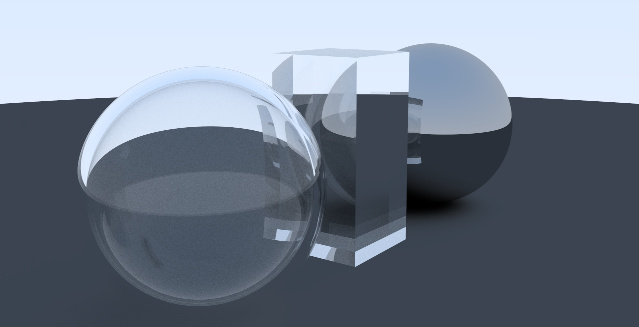

# Ray Tracer

A simple ray tracer heavily inspired by Peter Shirley's [ray tracing book series](https://raytracing.github.io/)

## Features
- Diffuse lighting
- Specular lighting
- Ray refraction
- Super sampling (Anti-aliasing)

## Usage
```
> dotnet run -o "outputFile.ppm"
```

### Arguments
```
-o, --output-file    Required. The path of the output file
-w, --width          (Default: 400) Width of the output image
-h, --height         (Default: 225) Height of the output image
-s, --samples        (Default: 200) The number of samples per pixel
-p, --max-delta      (Default: 0.0005) Maximum jitter of a unit-length ray to help with anti-aliasing
-d, --max-depth      (Default: 100) The maximum depth of recursion from a ray
```


